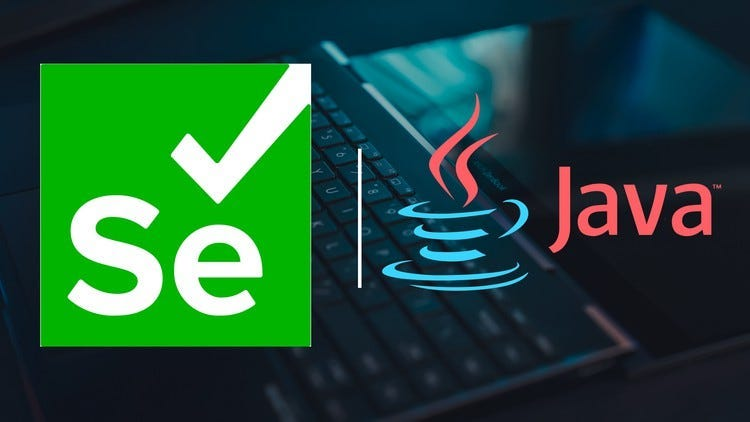

# Java-Testing-Selenium

Practicing Automated UI Testing with Selenium & Java.

## 📌 Overview
This repository contains a structured course on **Automated UI Testing** using **Selenium and Java**. It covers everything from setting up a project to working with Selenium interfaces, handling alerts, waits, and performing UI automation.

---



## 🎯 Practice Contents

### 📌 Part 1: Getting Started
- **Introduction to the Course**
- **Set Up Project**
- **First Selenium Test Using Java**

### 📌 Part 2: Page Object Model (POM)
- **Introduction to Page Object Model**
- **Create Page Object Model**
- **Create Test Using Page Object Model**

### 📌 Part 3: Working With WebElements
- **Introduction to WebElements**
- **Scroll To Element Using JavaScriptExecutor**
- **Working With Radio Buttons**
- **Working With Checkboxes**
- **Working With Tables**
- **Working With Links**
- **Working With Drop Downs**
- **Working With Dates**

### 📌 Part 4: Selenium Interfaces & Methods
- **Introduction to Selenium Interfaces & Methods**
- **How To Take A Screenshot**
- **How To Handle A Modal**
- **Switch To Information Alert**
- **Switch To Confirmation Alert**
- **Switch To Prompt Alert**
- **Switch To Frames Introduction**
- **Switch To Frames Using String**
- **Switch To Frames Using Index**
- **Switch To Frames Using WebElement**
- **Switch To Windows**
- **Explicit Wait**
- **Fluent Wait**
- **Implicit Wait**
- **Page Load Timeout & Script Timeout**
- **Simulate Mouse Movements**
- **Simulate Keyboard Events**

---

## 🔧 Tech Stack
- **Java** - Programming Language
- **Selenium WebDriver** - UI Automation Framework
- **JUnit/TestNG** - Testing Framework
- **Maven/Gradle** - Dependency Management
- **IntelliJ IDEA / Eclipse** - IDE for Java Development

---

## 🚀 Getting Started
1. Clone the repository:
   ```sh
   git clone https://github.com/SimpleCyber/Java-testing-Selenium.git
   ```
2. Open the project in **IntelliJ IDEA / Eclipse**.
3. Install dependencies using **Maven** or **Gradle**.
4. Run your first Selenium test:
   ```sh
   mvn test
   ```


---

## 📌 Contributing
If you would like to contribute:
1. Fork the repository.
2. Create a new branch.
3. Make your changes and push the branch.
4. Submit a pull request.

---

## 📜 License
This project is licensed under the MIT License.

---

Happy Testing! 🚀

